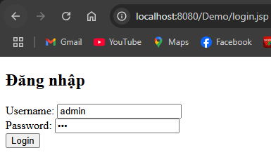
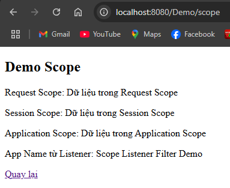

# Scope-Listener-Filter-JSP

Dự án mẫu minh họa **Scope, Listener và Filter** trong Java Web – thuộc môn học **Lập trình Java nâng cao**.
Ứng dụng được triển khai bằng **Servlet/JSP (Jakarta)** theo kiến trúc **Maven** và chạy trên **Apache Tomcat 10/11**.

---

## 1. Giới thiệu
- **Scope**:
    - `request`: tồn tại trong một request duy nhất.
    - `session`: tồn tại theo phiên làm việc người dùng.
    - application: tồn tại suốt vòng đời ứng dụng.
- **Listener**:
    - Theo dõi event khởi tạo/hủy ServletContext (ứng dụng)
    - Theo dõi event khởi tạo/hủy HttpSession (phiên người dùng)
- **Filter**:
    - Chặn truy cập trang scope nếu chưa đăng nhập.
    - Có thể mở rộng để log request hoặc xử lý encoding.

---

## 2. Tính năng
- Đăng nhập đơn giản (`admin` / `123`)
- Demo hiển thị dữ liệu từ **request/session/application scope**
- Ghi log khi **ứng dụng khởi tạo/hủy** và **session tạo/hủy**
- Filter kiểm tra đăng nhập trước khi vào trang Scope

---

## 3. Cấu trúc thư mục
```css
ScopeListenerFilterDemo/
 ├── src/main/java/com/example/demo
 │    ├── controller
 │    │    ├── LoginServlet.java
 │    │    └── ScopeServlet.java
 │    ├── filter
 │    │    └── AuthFilter.java
 │    └── listener
 │         ├── AppContextListener.java
 │         └── SessionListener.java
 │
 ├── src/main/webapp
 │    ├── WEB-INF/web.xml
 │    ├── index.jsp
 │    ├── login.jsp
 │    └── scope.jsp
 └── pom.xml
```

---

## 4. Yêu cầu môi trường
- **Java JDK 17+**
- **Apache Maven 3.8+**
- **Apache Tomcat 10 hoặc 11**
- IDE khuyến nghị: NetBeans / IntelliJ IDEA / Eclipse

---

## 5. Cài đặt & chạy
### 5.1 Clone project
```bash
git clone https://github.com/yourusername/ScopeListenerFilterDemo.git
cd ScopeListenerFilterDemo
```

### 5.2 Build project
```bash
mvn clean package
```

### 5.3 Deploy lên Tomcat
- Copy file `target/ScopeListenerFilterDemo.war` vào thư mục `webapps` của Tomcat
- Start Tomcat và truy cập:
http://localhost:8080/ScopeListenerFilterDemo

---

## 6. Hướng dẫn sử dụng
### 1. **Mở trang chủ:** `/index.jsp`
### 2. **Đăng nhập:**
- Username: `admin`
- Password: `123`
### 3. **Xem trang Scope:**
- Hiển thị dữ liệu từ `request`, `session`, `application`
- Ứng dụng log ra Console khi session được tạo/hủy

---

## 7. Minh họa giao diện
Trang Login<br>
<br>
Trang Scope<br>


---

## 8. Mở rộng
- Thêm **Filter logging request** (URI, thời gian)
- Thêm **Listener thuộc tính** (`HttpSessionAttributeListener`) để theo dõi thay đổi dữ liệu session
- Kết hợp JSTL để hiển thị dữ liệu scope đẹp hơn

---

### 9. Giấy phép
Dự án này sử dụng giấy phép MIT.

---

### 10. Tác giả
Bảo Minh – GitHub

---
